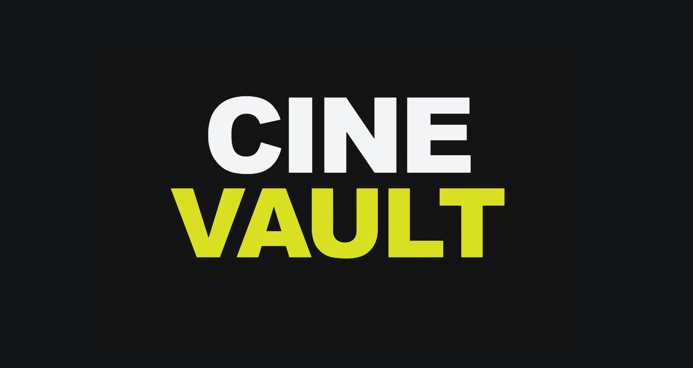

# CineVault



CineVault is a React movie and TV discovery application built for the Ironhack Module 2 project. It combines TMDB data, reusable React components, client-side routing, watchlist CRUD behavior, and a polished streaming-style interface.

## Live Demo

- Live app: https://cine-vault-tan.vercel.app/
- Presentation deck: https://aliihsaad.github.io/cinevault-presentation/
- Watchlist API repo: https://github.com/aliihsaad/cinevault-api

## Project Overview

CineVault lets users browse movies and TV shows, explore detailed media pages, search TMDB content, discover titles by genre, and manage a personal watchlist. The project focuses on building a real React application from multiple connected features rather than isolated exercises.

Core goals:

- Build a complete single-page application with React and Vite.
- Use React Router for multi-page navigation.
- Fetch real movie/TV data from TMDB.
- Manage shared app state with Context API.
- Implement watchlist CRUD against a backend API.
- Build reusable UI components for cards, carousels, dialogs, badges, and page sections.
- Practice team collaboration through branches, pull requests, merge conflict resolution, and shared code ownership.

## Features

- Homepage with featured media sections
- Rotating hero banner for highlighted movies/TV shows
- Movies page and TV Shows page
- Movie detail and TV detail pages
- Cast, gallery, reviews, overview, and episode-related detail sections
- Search page for finding movies and TV shows from TMDB
- Genre discovery flow
- Profile dashboard UI
- Watchlist page with add, update, remove, and read behavior
- Sidebar navigation with route-based active states
- Responsive UI styling
- Empty, loading, and fallback states for API-driven screens

## Tech Stack

| Area | Technology |
| --- | --- |
| Frontend | React, Vite |
| Routing | React Router |
| API Client | Axios |
| Movie Data | TMDB API |
| State Management | React Context API, React hooks |
| UI Components | shadcn/ui, Base UI, lucide-react |
| Styling | CSS, Tailwind CSS, shadcn styles |
| Backend/CRUD Practice | CineVault API / JSON Server-compatible watchlist API |
| Deployment | Vercel |

## Beyond The Curriculum

The project also used tools and patterns beyond the core Ironhack curriculum:

- shadcn/ui for reusable UI components
- Tailwind CSS integration
- `class-variance-authority` and `tailwind-merge` for component styling utilities
- defensive rendering for API data
- cancel-guard patterns for async effects
- `Promise.finally()` for cleanup flows
- `useMemo` and `useCallback` in performance-sensitive areas
- AI-assisted debugging and styling review

JSON Server was used as a course-covered local/backend CRUD tool for watchlist persistence practice.

## Team

| Contributor | GitHub | Focus Area |
| --- | --- | --- |
| Ali Saad | [@aliihsaad](https://github.com/aliihsaad) | Interface architecture, watchlist flow, sidebar/routing, Search UI improvements |
| Noah Perez | [@NoahPerez](https://github.com/NoahPerez) | Project setup, TMDB data flow, detail pages, search, reusable data sections |
| Almas Khan | [@Almas-Eclipse](https://github.com/Almas-Eclipse) | Genre discovery, profile dashboard, loading fixes, route-safety fixes |

## Getting Started

### Prerequisites

- Node.js
- npm
- TMDB account with API access
- CineVault API or another JSON Server-compatible watchlist API URL

### Installation

```bash
npm install
```

### Environment Variables

Create a `.env` file in the project root:

```bash
cp .env.example .env
```

Fill in the required values:

```env
VITE_TMDB_BASE_URL=https://api.themoviedb.org/3
VITE_TMDB_API_KEY=your_tmdb_api_key
VITE_TMDB_READ_ACCESS_TOKEN=your_tmdb_read_access_token

VITE_WATCHLIST_API_URL=your_cinevault_api_base_url
```

The frontend expects:

- `VITE_TMDB_BASE_URL` for TMDB requests
- `VITE_TMDB_READ_ACCESS_TOKEN` for authenticated TMDB API calls
- `VITE_WATCHLIST_API_URL` for watchlist CRUD requests through the CineVault API

### Run Locally

```bash
npm run dev
```

The local Vite URL will usually be:

```text
http://localhost:5173
```

### Build

```bash
npm run build
```

### Preview Production Build

```bash
npm run preview
```

### Lint

```bash
npm run lint
```

## App Routes

| Route | Page |
| --- | --- |
| `/` | Homepage |
| `/movies` | Movies |
| `/tv-shows` | TV Shows |
| `/search` | Search |
| `/movie/:id` | Movie details |
| `/tv/:id` | TV details |
| `/watchlist` | Watchlist |
| `/profile` | Profile |
| `/genre/:id` | Genre page |
| `*` | Not found page |

## Project Structure

```text
src/
  api/              Watchlist API client
  components/       Reusable UI and feature components
  components/ui/    shadcn/ui component files
  context/          Shared React Context state
  lib/              API and utility helpers
  pages/            Route-level pages
```

## Key Implementation Notes

### TMDB API Flow

TMDB requests are handled through an Axios instance in `src/lib/api.js`. The base URL and bearer token come from Vite environment variables.

### Watchlist Flow

The watchlist uses a separate Axios client in `src/api/watchlist.js`. The app expects `VITE_WATCHLIST_API_URL` to point to the backend API used for saved items.

The watchlist flow follows this pattern:

1. User clicks a save/remove/update action.
2. The app sends the request to the watchlist API.
3. React state updates after the backend confirms the result.
4. The UI re-renders with the latest watchlist state.

### Rotating Hero Banner

The hero banner uses React state and an interval-based effect:

- `useState` stores the current hero index.
- `useEffect` starts the timer.
- `setInterval` moves to the next item automatically.
- modulo `%` loops back to the first item.
- `clearInterval` prevents timer leaks when the component unmounts.

### shadcn/ui Usage

The project uses shadcn/ui as an additional UI component library beyond the main curriculum. Components such as buttons, inputs, badges, dialogs, and carousels are imported from `src/components/ui`.

## Challenges Solved

- Splitting large pages into smaller reusable components
- Deciding what logic belongs in Context API versus page-level state
- Keeping watchlist frontend state synced with backend persistence
- Preventing duplicate watchlist items using media id and media type
- Handling route params that arrive as strings
- Fixing genre page loading behavior
- Converting TMDB rating data into user-friendly star UI
- Resolving merge conflicts in shared files
- Maintaining consistent UI across multiple contributors

## Deployment

The app is deployed on Vercel:

```text
https://cine-vault-tan.vercel.app/
```

For deployment, configure the same environment variables in the Vercel project settings.

Backend/watchlist API source:

```text
https://github.com/aliihsaad/cinevault-api
```

## Presentation

The project presentation is deployed separately through GitHub Pages:

```text
https://aliihsaad.github.io/cinevault-presentation/
```

The presentation includes:

- team contribution breakdown
- GitHub collaboration history
- code walkthroughs
- challenges and bug fixes
- curriculum vs. beyond-curriculum mapping
- AI usage explanation

## Credits

Built by Ali Saad, Noah Perez, and Almas Khan as part of the Ironhack Module 2 project.
